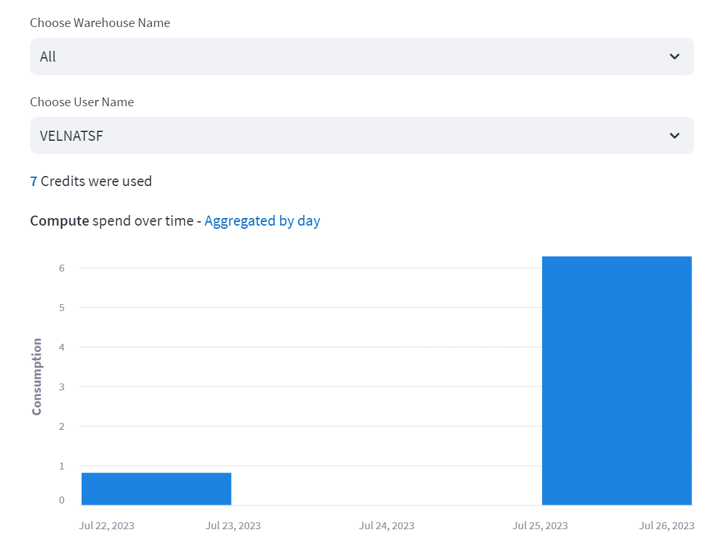

## Snowflake Warehouse Management with Streamlit Application
This README contains the overview and environment setup instructions.

## Step 1 - Setup Snowflake Environment
This step create the necessary user, role, warehouse, database, and schema for hosting Warehouse management application. We will create 3 warehouse for user to choose based on workload demand SMALL, MEDICUM AND LARGE.

Login and assume ACCOUNTADMIN role to execute the SQL script `databasesetup.sql`.
To run all the queries in this script, use the "Execute All Statements" button in the upper right corner of the editor window.

Note: For demo purpose, I have created the free trail Snowflake account and completed installing the database objects. The credentials were stored in secret for Streamlit application access. You can skip this step.

## Step 2 - Setup Python environment using Conda
Python 3.9 version is required to run the application that is hosted on Stramlit (https://docs.streamlit.io/knowledge-base/tutorials/databases/snowflake)

## Step 2.1 - Use Pre-Build Codespace from GitHub

Start the pre-build Codespace from: (https://github.com/velnatkar4/snowflake-whmgmt/codespaces)
Click on "sf-codespace" and it will resume the codespace if it's stopped.


## Step 2.2 - Create new Codespace from Github

From Github open code => codespaces => create codespace on main(https://github.com/velnatkar4/snowflake-mgmt)

You get prompted to Terminal after setup. Create a new conda environment with Python 3.9 and install all required packages.

```
conda create -n snowmgmt39 python=3.9
conda init
exit
```

Close and open a new Terminal to continue with next steps of installing packages.

```
conda activate snowmgmt39
python -m pip install -r requirements.txt
```

## Step 3 - Start Streamlit Application

We have built a Streamlit application to visualize the request form, admin review and warehouse and query usage
Start streamlit application from conda environment.

```
conda activate snowmgmt39
streamlit run UserRequestForm.py
```


To stop the Streamlit Application

```ctrl + c```

## Step 4 - User Request large Compute

Existing Snowflake user use this form to request larger compute (SMALL, MEDIUM or LARGE) to fulfill their workload


## Step 5 - Admin review and approve and reject the request

Admin periodically review the user request and make decision based on the Warehouse usage by user


## Step 6 - Warehouse Usage

Warehouse credit usage for ALL warehouse or by given warehouse is presented in Bar chart for given data range

Queries with long execution time is presented for given user.


## Step 7 - Verify Unauthorized request

To see what request in pending for Admin review switch to Snowflake and run:
```SELECT REQUEST_USER,REQUEST_COMPUTE,REQUEST_REASON,REQUEST_TIMESTAMP,REVIEW_USERFROM WH_REQUEST_TRACKERWHERE REVIEW_USER IS NULLORDER BY REQUEST_USER DESC;```
